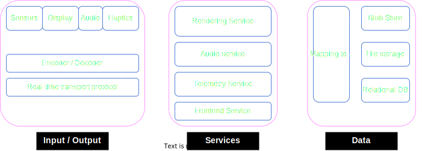

# Myvatar - An end-to-end Avatar system
## High-level design
Table of Contents
1. [Functional Requirements](#functional-requirements)
    * [User Scenarios](#scenarios)
        * [Input](#input)
        * [Output](#output)
2. [Architecture](#architecture)
    * [Input/output](#input--output)
    * [Services](#services)
    * [Data](#data)

### Functional Requirements
    Personas
     - User 1
     - User 2
### User Scenarios

### Input Scenario
1. As User 1, I want to create an avatar.
2. As User 1, I want device sensors to capture sensory information as I use the system. 
2. As User 1, I want to record audio in my default language.
4. As User 1, I want to listen to recordings in my default language
#### Output Scenario
1. As User 2, I want to view an avatar belonging to User 1 in its basic form(Without sensory input).
2. As User 2, I want to view an avatar belonging to User 1 along with sensory information.
3. As User 2 I want to hear Audio from User 1
4. As User 2 I want to hear Audio from User 1 translated to my default language.

### Architecture

### Input/Output
The input/output component should have all or some of the following capabilities. A subset of the capabilities listed below will provide a limited experience. For example, by default. browsers might not be able to capture sensory information
1. **Sensors:** Capture real-time sensory data from the user. 
2. **Displays:** Rendering of avatar(s).
3. **Audio systems:** Capture and playback audio in various formats.
4. **Haptics**: Play back of sensory data.
4. **Encoder / Decoder:** Encode data coming from the sensors and audio systems. Decode data coming back into the system into formats that can be rendered by the display and played back by the audio system. In the case of haptic-enabled systems, this should also encode and decode haptic data. 
5. **Real-time Transport (RTP):** A real-time transport protocol that powers communication between the input/output systems and external services. 

### Services
**Front-end Services:** This service provides user management, Load-balancing and security.
**Rendering Services:** 
**Audio:** This service manages audio data and language translation. It should also contain an AI engine that utilizes voice signatures for each user to generate translated audio. This will help provide an enriched user experience.
**Telemetry:** Management of telemetry data coming from devices and services. This service should be capable of ingesting data streams and performing real-time analytics.

### Data
**Mapping Tool:** Enable simplified data storage and retrieval. 

**Blob Store:** Storage of binary data from sensors.

**File storage:** Storage of audio and image data. Telemetry data can also be stored here. 
**Relational Database:** Storage of relational data such as user information and links to data in both the file and blob storage. 

